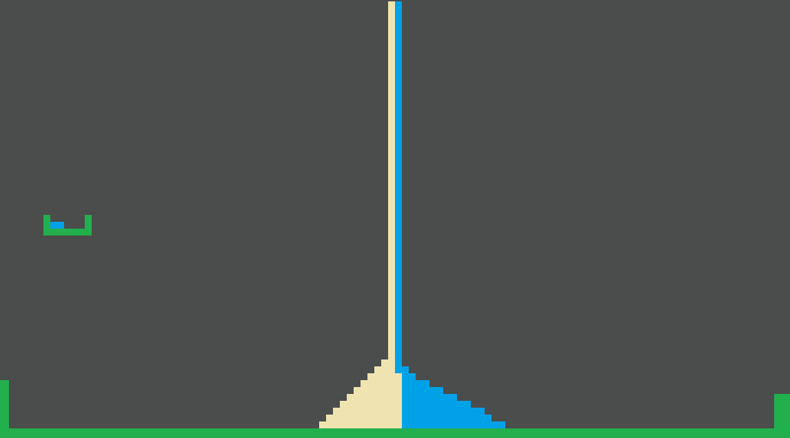

# Tree Automata Godot 4.1 practice

this project holds a simple automata which depicts a tree capable of growing, blooming and spreading its seed

the project starts with plain dirt with some seeds spread over, water randomly drops (rain) and can make the dirt wet.

seed or root can absorb wet dirt which will make it self filled. Filled root or seed can either spawn branch or more root

filled branch can spawn leaves and flower

flower can spawn seed, which will drop

## Architecture

In order to support drawing on the scene, we base the cells as a 1px tile on a tilemap. Currently each tile type is only referenced by its atlas coord to determine its type. To support complex individual cell state, we can support a separate 2d array which only gets updated after the tilemap is udpated 
